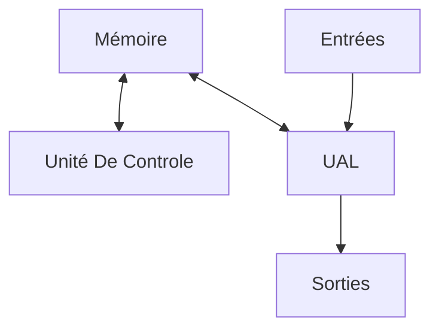

# 2. Architecture des ordinateurs

___

## 1. Définition

Un ordinateur est une machine électronique, numérique, programmable, capable d'effectuer des opérations arithmétiques de base.

Le modèle conceptuel d'un ordinateur est le suivant :
* **UAL**(Unité Arithmétique et Logique) : effectue les opérations
* **Unité de contrôle** : séquence les opérations
* **Mémoire** : stocke données et programmes
* **Entrées/Sorties** : communication externe

## 2. Unité et codage de l'information

Le **binary digit** ou **bit** est l'unité élémentaire de stockage et de mesure de l'information. Il s'agit d'une information binaire valant 0 ou 1. Ils sont regroupés en **octets** composés de 8 bits. 

On a deux valeurs possibles, 8 fois, soit 256 valeurs (2^8), de 0 à 255.

## 3. Les composants

#### CPU

Le **CPU** (Central Processing Unit) est l'unité de calcul. Il s'agit d'un circuit intégré regroupant:
* UAL et Control Unit
* Horloge
* Registres
* Mémoires cache

Le CPU est caractérisé par un jeu d'instructions, une fréquence ainsi que la taille des registres généraux.

#### RAM

La **RAM** (Random Access Memory) est la mémoire vive. Elle est disponible en accès direct (pas séquentiel), et n'est pas faite pour enregistrer des données en message ou servir de périphérique de stockage.

Il s'agit d'une mémoire de stockage rapide et temporaire utilisée par les programmes.

#### Carte mère

La carte mère est la station d'accueil des composants. Elle peut être sous différents formats (microATX, ATX...). 

Elle est composée de :
* Chipset et connecteur CPU
* Connecteurs mémoire 
* Connecteurs cartes (PCI, PCIe...)
* Connecteurs stockage (M2, NVMe, SATA...)
* Périphériques I/O intégrés (carte réseau, carte son...)

Chaque carte mère a un firmware, stocké sur la mémoire morte, ROM (Read Only Memory). Le BIOS (Basic Input Output System) sert à détecter les périphériques, gérer la configuration générale de l'ordinateur, ou le périphérique de démarrage. 

Aujourd'hui, le BIOS peut être remplacé par sa version UEFI (Unified Extensible Firmware Interface). Ces versions disposent de fonctionnalités plus avancées, pouvant parfois gérer une GUI.

#### Boîtier

Le boîter sert à accueillir la carte mère et les composants. Il peut s'agir d'une tour, d'un rack etc. Le boîter accueille l'alimentation et gère le refroidissement.

## 4. Le stockage

Il existe deux types de périphériques de stockage principaux : **HDD** (Hard Disk Drive) et **SSD** (Solid State Drive).

Le **HDD** fonctionne avec un système de plateau et de tête de lecture. La lecture fonctionne par secteurs, elle est séquentielle. Les pannes rencontrées sont généralement mécaniques.

Le **SSD** utilise de la mémoire flash, électronique. C'est plus rapide, mais limité en nombre d'écritures, généralement moins durable qu'un HDD.

En général, le secteur d'un disque fait 512 octets. Chaque secteur est une séquence binaire. En théorie, une machine 64 bits devrait pouvoir adresser 8 Zébioctets de données (*c'est beaucoup beaucoup*).

En général, un disque dur est partitionné. Le **MBR** est le système de partitionnement intel historique. Il est assez limité, et ne peut disposer que de 4 partitions primaires. Une des partitions primaires peut servir d'**EBR** (Extended Boot Record), et servir à créer d'autres partitions, mais qui ne seront que des partitions logiques.

Le système **GPT** (GUID Partition Table) est utilisé aujourd'hui. Les partitions y sont identifiées par des **GUID** (Globally Unique Partition Identifiers). Avec le système GPT, on peut avoir 128 partitions maximum.

## 5. Les périphériques I/O

Des périphériques d'entrée :
* Clavier
* Souris
* Ecran tactile
* Webcam
* Microphone
* Scanner
* Carte réseau

Des périphériques de sortie :
* Ecran
* Carte son
* Haut-parleurs
* Casque audio
* Carte réseau
* Imprimante
* Projecteur 

